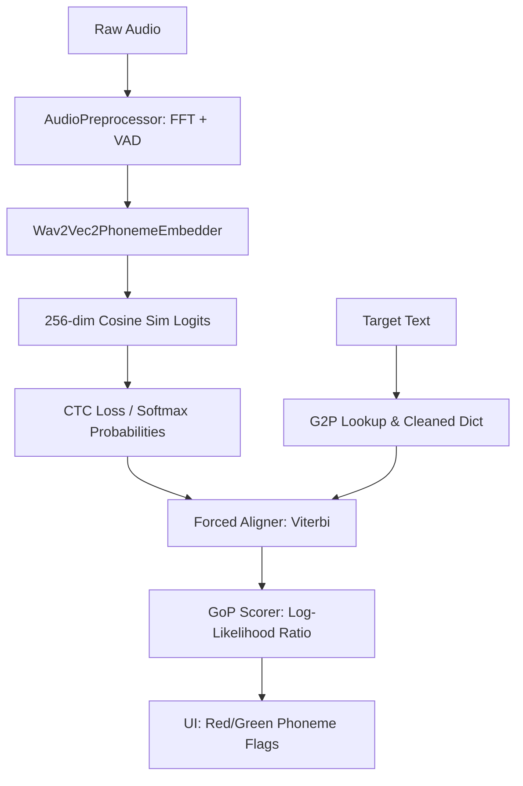

# Implementation Plan: Articulatory Pronunciation Retraining & GoP Diagnostics (Clear Indian English Blueprint)

This plan details the architecture, data mixture strategy, G2P dictionary cleansing, model training constraints, and forced alignment diagnostics required to rebuild the CDAC ASR phoneme embedder model into an active pronunciation diagnostic engine.

---

## User Review Required

### 1. Dataset Mixture & Hugging Face Access
> [!IMPORTANT]
> The dataset mixture aggregates 5 distinct sources to regularize and eliminate regional Tamil/Telugu bias (from the baseline NPTEL lectures):
> 1. **AI4Bharat NPTEL** (50%): Baseline dataset (`skbose/indian-english-nptel-v0`).
> 2. **Mozilla Common Voice (India)** (20%): Gated dataset requiring accepted terms on Hugging Face and an active `HF_TOKEN`. Filtered for West Indian locales (Gujarati, Marathi).
> 3. **AI4Bharat Svarah** (10%): Benchmarked Indian English dataset (`ai4bharat/Svarah`). Filtered for North Indian locales (Hindi/Punjabi primary languages) using `meta_speaker_stats.csv`.
> 4. **OpenSLR 104 (MUCS)** (10%): Indian code-switched speech dataset. Filtered for the Bengali-English split (Eastern region).
> 5. **Eka Care Medical ASR** (10%): Gated clinical dictation dataset (`eka-care/medical-asr`) providing domain-specific vocabulary.
>
> Ensure that your environment has `HF_TOKEN` set and that you have accepted access permissions for gated datasets (Common Voice, Eka Care) on Hugging Face before starting.

### 2. Accent Filtration Protocols
To prevent the model from learning native Indian languages (Hindi, Marathi, Bengali, Tamil, etc.), we apply strict linguistic constraints:
* **Transcript Filter**: Exclude any utterance whose transcription contains non-English Unicode character ranges (e.g. Devanagari, Bengali script). Only Latin characters `[A-Za-z']` are tokenized.
* **Lexical Filter**: Verify that all tokens in the transcript exist in either the G2P dictionary or neural fallback vocabulary list. Utterances consisting entirely of regional words are discarded at the dataloader step.

### 3. Noise Enrichment & Preprocessing
Common Voice India records are notoriously noisy. We will configure the `AudioPreprocessor` with robust thresholds:
* **Adaptive Spectral Subtraction**: Dynamically adjust the noise reduction factor $\alpha$ in `AudioPreprocessor.apply_fft_filter` from $0.02$ to $0.04$ for noisy datasets.
* **VAD Padding**: Add a small temporal padding (e.g., 100ms) on each side of the Silero VAD speech boundaries to prevent clipping initial/final consonants in noisy streams.

### 4. G2P Training Integration
> [!NOTE]
> G2P model training is excluded from this phase. The user will provide a separate plan for G2P training.

---

## Proposed Changes



### Component 1: Data Preparation & Mixture Pipeline

#### [MODIFY] [download_and_preprocess.py](file:///home/mihir/Codes/CDAC_ASR/research/download_and_preprocess.py)
* **Regional Accent Balancing Loader**:
  - Implement loaders for the 5 datasets with specific filtering scripts:
    - **Mozilla Common Voice (India)**: Filter English locales for speakers indicating Marathi/Gujarati accents.
    - **AI4Bharat Svarah**: Cross-reference `meta_speaker_stats.csv` or dataset metadata fields for speakers indicating Hindi/Punjabi primary language.
    - **OpenSLR 104**: Isolate the Bengali-English code-switched speech partition.
    - **Eka Care**: Load clinical audio for vocabulary domain-injection.
  - Implement a validation step to filter out synthetic recordings (e.g. checking for features like `is_synthetic` or metadata source fields).
* **Linguistic Accent Filter**:
  - Add logic to discard utterances with native language texts or script tags.
* **Proportion Sampler**:
  - Sample and mix the dataset partitions using the exact proportions:
    - 50% NPTEL ASR
    - 20% Common Voice India (West Indian accents)
    - 10% Svarah (North Indian accents)
    - 10% OpenSLR 104 (East Indian accents)
    - 10% Eka Care Medical ASR
  - Shuffle the concatenated dataset and write standard train/val/test splits.
* **G2P Vocabulary Extraction & Merging**:
  - Build a G2P vocabulary verification check. Run all text items from the non-NPTEL datasets through the `G2PManager` and model tokenizer.
  - If a word maps to an `<unk>` token, log it to `research/g2p/patch_vocab.dict`.
  - At the start of preprocessing, load `patch_vocab.dict` if it exists and merge its mappings into the G2P manager dictionary to eliminate `<unk>` artifacts from training.

---

### Component 2: Model Training Callbacks & Constraints

#### [MODIFY] [train_local.py](file:///home/mihir/Codes/CDAC_ASR/research/train_local.py)
* **Embedding Diversity Monitor**: Ensure `ModelHealthCheckCallback` logs the embedding diversity index ($1 - \text{avg\_similarity}$) and triggers early stopping if similarity exceeds $0.85$ (diversity $< 0.15$).
* **Zero-`<unk>` Assertion**:
  - Add an assertion in the validation checks to verify that the count of predicted `<unk>` tokens is exactly 0.
  - *Safety Guard*: To prevent crashes during random initialization in early epochs, only enable this assertion after the warmup steps (e.g. step > `warmup_limit`).
* **PER Early Stopping**:
  - Monitor validation PER on the NPTEL subset and trigger final model saving and training exit when validation PER drops below 15%.

---

### Component 3: Forced Aligner & GoP Engine

#### [MODIFY] [ScoreCalcs.py](file:///home/mihir/Codes/CDAC_ASR/research/ScoreCalcs.py)
* **Forced Aligner Method**:
  - Implement a CTC forced alignment method using `torchaudio.functional.forced_align`.
  - Inputs: Log probabilities from model (`log_probs`), target phoneme token IDs (`targets`).
  - Output: Timings for each target phoneme (start and end frames).
* **GoP Scorer**:
  - Calculate GoP using the Log-Likelihood Ratio:
    $$\text{GoP}(p) = \frac{1}{t_2 - t_1 + 1} \sum_{t=t_1}^{t_2} \log P(p \mid O_t)$$
    Where $P(p \mid O_t)$ is the softmax probability of target phoneme $p$ at frame $t$.
  - Convert frame indices to milliseconds (using Wav2Vec2's 20ms frame stride).
  - Compute target GoP probability as $\exp(\text{GoP}(p))$ and flag `is_correct` as a boolean based on a 40% probability threshold.
  - Return: List of expected phonemes, start/end milliseconds, GoP probability, and `is_correct` flag.

#### [MODIFY] [inference_api.py](file:///home/mihir/Codes/CDAC_ASR/research/inference_api.py)
* Update `run_inference` to call the new forced aligner and GoP scoring engine, passing down model logits and target phoneme IDs, and mapping outcomes to the updated schema.

---

### Component 4: System Validation (Corrupt Audio Verification)

#### [NEW] [verify_gop_system.py](file:///home/mihir/Codes/CDAC_ASR/research/verify_gop_system.py)
* **Audio Slicer**: Slices audio files based on reference phoneme alignment frame boundaries.
* **Corruptor**: Low-pass filters or replaces the target phoneme segment (e.g. the `/ʈ/` in `ʈ oː d̪`) with silence/noise.
* **Assertions**:
  - Verifies that the aligner maps the segment boundaries correctly.
  - Asserts that the GoP score for the corrupted `/ʈ/` falls below 40% (flagged as incorrect).
  - Asserts that uncorrupted phonemes (`/oː/`, `/d̪/`) maintain high GoP scores ($>40\%$, flagged as correct).

---

## Verification Plan

### Automated Tests
1. **G2P Clean Check**: Verify `patch_vocab.dict` generation and merge logic.
2. **System Validation Run**:
   ```bash
   python research/verify_gop_system.py
   ```
   Must execute successfully and pass all corruption/GoP boundaries assertions.
