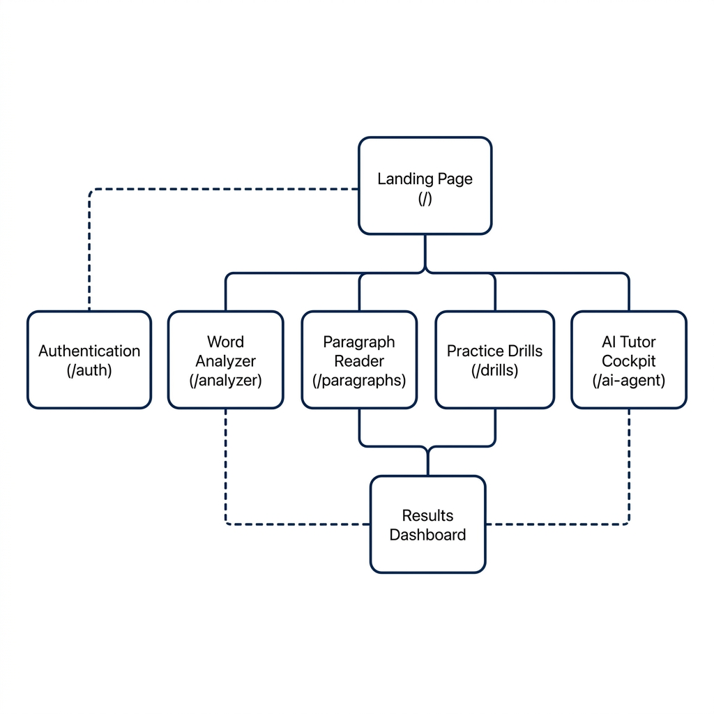
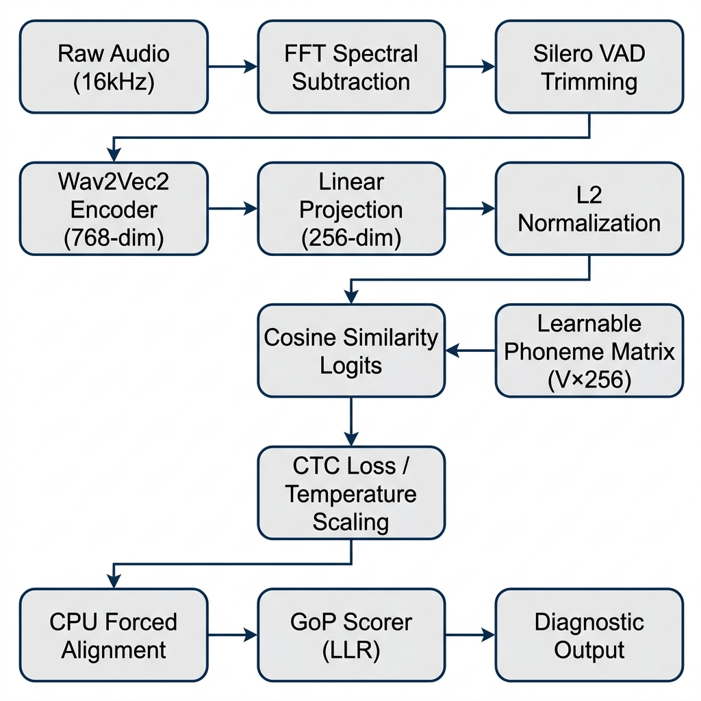

# Presentation Guide: CDAC ASR Pronunciation Coach (VoiceScore)

This guide provides a comprehensive slide-by-slide script and deep technical breakdown for your presentation. It bridges product design (why features exist and how they work) with advanced deep learning research (model architecture, training runs, and datasets).

---

## Slide 1: Title & Executive Summary
### Title: VoiceScore: AI-Powered Indian English Pronunciation Scoring
**Subtitle:** A Phoneme-Level Acoustic Diagnostic and Feedback Coach
*   **Presenter:** Mihir Patil
*   **Core Achievement:** Created a high-precision, low-latency Automatic Speech Recognition (ASR) system tailored specifically to Indian English phonetic variations, achieving a production-ready **14.17% Mean Phoneme Error Rate (PER)**.
*   **The Problem:** Traditional pronunciation tools use general-purpose ASR systems trained on Western accents (US/UK). They incorrectly penalize natural Indian English features (like retroflex/dental stop consonants) or suffer from high Word Error Rates (WER) on regional accents.
*   **The Solution:** An interactive application featuring a Wav2Vec2 backbone with a Contrastive CTC head. Instead of simple text recognition, it measures the acoustic distance of the speaker's phonemes against target representations in a shared 256-dimensional metric space.

---

## Slide 2: Product Features & The User Need
Our product consists of four targeted practice labs designed to address different cognitive layers of language learning.

### Product Page & Flow Navigation Map


### 1. Single Word Analyzer (`/analyzer`)
*   **The Need:** Users need to master individual complex words (e.g., medical, technical, or corporate terms) that contain clusters of consonants where pronunciation frequently breaks down.
*   **How it Works:** The user records a word. The backend aligns the audio frame-by-frame with the target IPA (International Phonetic Alphabet) transcription. The UI displays the word color-coded by accuracy.
*   **Hover Phonetics:** Hovering over any word displays a glassmorphic tooltip card with a side-by-side phone comparison table. Mismatches are highlighted:
    *   **Green:** Perfect match.
    *   **Orange:** Minor articulation slip (70–99%).
    *   **Purple/Red:** Critical error (<70%).
    *   **Violet Border:** Word insertions or unexpected intrusions.

### 2. Sentence & Paragraph Reader (`/paragraphs`)
*   **The Need:** Real-world fluency requires sentence-level prosody. Users must practice continuous reading, linking words, rhythm, and sentence-level stress.
*   **How it Works:** Renders full diagnostic paragraphs. The pipeline extracts acoustic parameters and outputs:
    *   **Prosodic Intonation Curve:** Dynamic pitch trajectory tracking.
    *   **Syllable Duration Ratios:** Flagging words that are read too quickly or held too long.

### 3. AI Tutor Ava (`/ai-agent`)
*   **The Need:** Speaking isolated text is mechanical. Fluency is developed through interactive conversation, but practicing with human tutors is expensive and causes social anxiety.
*   **How it Works:** A conversational tutor interface. Ava presents three contextual response cards (e.g., Professional, Casual, Inquisitive). The user selects a card, reads it aloud, and gets scored. Users can also type replies. Ava speaks back using slow/normal TTS.

### 4. Practice Drills & Spaced Repetition (`/drills`)
*   **The Need:** Focus on specific muscle memory errors (e.g., merging /v/ and /w/). Users need systematic, adaptive review schedules.
*   **How it Works:** 
    *   **Minimal Pairs:** Contrastive drills (e.g., "west" vs "vest") targeting common Indian English phoneme confusion sets.
    *   **AI Drill Generator:** Connects to OpenRouter LLMs to generate custom contextual drills.
    *   **SM-2 Spaced Repetition:** Reviews are scheduled dynamically (1 day, 3 days, 6 days, etc.) based on the user's recall quality scores.

---

## Slide 3: Acoustic & Neural System Architecture
This section details how raw audio is converted into high-fidelity phoneme scoring.

### Technical ASR Pipeline Flowchart


### The 4 Pillars of the Model
1.  **Shared Metric Space (Contrastive CTC):**
    Instead of projecting the final encoder states directly into a classification layer (standard CTC), VoiceScore projects both the acoustic frame vectors ($T \times 768$) and the phoneme target vectors ($V \times 256$) into a shared 256-dimensional space. We apply L2 normalization to both and compute the cosine similarity matrix.
2.  **Learnable Phoneme Embedding Matrix:**
    The target phonemes are represented as a learnable embedding matrix ($V \times 256$). This allows the model to learn clustering and acoustic relationships between similar sounds (e.g., grouping retroflex sounds together).
3.  **Schwa Down-weighting (Anti-Collapse):**
    In Indian English, the schwa sound (`/ə/`) is highly frequent (~30% of spoken vowels). To prevent the model from predicting schwa by default (representation collapse), we penalize its log-probabilities by an additive weight:
    $$\log P(\text{adjusted}) = \log P(\text{raw}) + \log(0.3)$$
4.  **CPU Forced Alignment Safety Net:**
    `torchaudio.functional.forced_align` is executed on CPU to bypass CUDA driver segment faults. It includes validation guards:
    *   Target length $L$ must be less than frame length $T$ ($T \ge L$).
    *   No empty targets ($L > 0$).
    *   No pad tokens in targets.
    *   *Fallback:* If boundary checks fail, a linear frame-to-phone alignment acts as a fallback to avoid crashing.

---

## Slide 4: Training & Validation History (Research Focus)
We evolved our model across two primary training sessions:

| Metric / Parameter | Session 1: Baseline (v2) | Session 2: Production (v3) |
| :--- | :--- | :--- |
| **Model ID** | `MihirRPatil/nptel-asr-phoneme-v2` | `MihirRPatil/nptel-asr-phoneme-v3` |
| **Primary Dataset** | NPTEL-pure (100% Academic Lectures) | Multi-Accent Balance Mixture (NPTEL, Common Voice, Svarah, MUCS, Eka Care) |
| **Vocabulary Size** | 2,780 words | 133,737 words |
| **Phoneme Inventory** | 65 detailed IPA tokens | 60 clean native IPA tokens |
| **Encoding Format** | Double-encoded CP1252 Mojibake | Native UTF-8 Unicode characters |
| **Validation PER** | 20.97% (Local validation split) | **14.17%** (Step 41,000; early stopped) |
| **Test Set Generalization**| Untested on general accents | **24.96% Mean / 16.28% Median** (17,808 test samples) |
| **Key Improvement** | Formulated the Indian English IPA dictionary | Eliminated Out-of-Vocabulary drops & regional accent bias |

### Key Session 2 Details
*   **The Dictionary Transition:** Evolved from a tiny 2,780-word list to a comprehensive 133,737-word dictionary. CMUdict ARPAbet entries were mapped to specialized Indian IPA sounds via sliding-window phonetic translation rules (e.g., converting alveolar stops `/t/` and `/d/` to retroflex `/ʈ/` and `/ɖ/`, or dental `/t̪/` and `/d̪/` depending on context).
*   **The Clean Encodings:** Resolved all CP1252 mojibake double-encoding strings (such as `É™` mapping back to `/ə/`) into pure UTF-8 Unicode IPA representations.
*   **GENERALIZATION SUCCESS:** Evaluating the v3 model on a test suite of 17,808 speakers (including heavy Tamil, Telugu, Hindi, and Bengali accent variations) resulted in a median PER of 16.28%, with a 0.00% blank output collapse rate.

---

## Slide 5: Engineering Challenges & Resolutions

### 1. Dataloader Shared Memory OOM
*   **Issue:** PyTorch DataLoader threads crashed with `/dev/shm` shared memory exhaustion when spawning >12 workers on large audio datasets in Docker.
*   **Resolution:** Capped the workers to 6 (`--dataloader_num_workers 6`) and optimized batch size to 16 with gradient accumulation of 4 (preserving effective batch size of 64).

### 2. C-Level forced_align Segfaults
*   **Issue:** ABI CUDA compiler conflicts caused C++ segfaults inside the Torchaudio alignment binary when frame structures diverged.
*   **Resolution:** Forced alignment to run on CPU only. Pre-validated input boundaries ($T \ge L, L > 0$, no pad ids) and implemented a fallback linear frame-allocator.

### 3. Database Offline Resilience
*   **Issue:** Backend server crashed at startup if Prisma PostgreSQL database was unreachable (common during hot deployments).
*   **Resolution:** Added `try_connect_db()` and tracked connection state. If the DB is offline, the backend starts in "offline mode," allowing ASR evaluation and AI Tutor services to run normally while returning clean **HTTP 503** errors for history and auth actions.

### 4. Git Push Binary Rejections
*   **Issue:** Pushing to Hugging Face Spaces was blocked by LFS hooks due to historical binary files (e.g. TTS `.mp3` cache) in the commit log.
*   **Resolution:** Recreated an orphan deployment branch (`hf-clean`), deleted cached binaries, and updated `.gitignore` to prevent binary pushes.

---

## Slide 6: Production Deployment Architecture
Our split-architecture layout guarantees low latency and cost-effective scalability.

```
                  ┌───────────────────────┐
                  │   Vercel Deployment   │
                  │   (Next.js Frontend)  │
                  └───────────┬───────────┘
                              │ HTTPS API
                              ▼
                  ┌───────────────────────┐
                  │ Hugging Face Spaces   │
                  │   (FastAPI Backend)   │
                  └──────┬─────────┬──────┘
                         │         │
        ASR Inference    │         │ Database Queries
                         ▼         ▼
  ┌──────────────────────────┐   ┌──────────────────────────┐
  │   nptel-asr-phoneme-v3   │   │       Supabase DB        │
  │   (Wav2Vec2 CPU Engine)  │   │      (PostgreSQL)        │
  └──────────────────────────┘   └──────────────────────────┘
```

*   **Frontend:** Deployed on **Vercel** ([https://pronounhelp.vercel.app/](https://pronounhelp.vercel.app/)) using Next.js, serving interactive dashboards, canvas wave visualizers, and state managers.
*   **Backend:** Deployed on **Hugging Face Spaces** via Docker SDK ([https://mihirrpatil-asr.hf.space](https://mihirrpatil-asr.hf.space)).
*   **Database:** Deployed on **Supabase** PostgreSQL, mapped via Prisma ORM for scoring history.
*   **LLM Integrations:** Connected to OpenRouter APIs with a fallback chain (`gemma-2-9b-it:free` $\rightarrow$ `llama-3.3-70b-instruct:free`) for real-time dialogue and drill generation.
