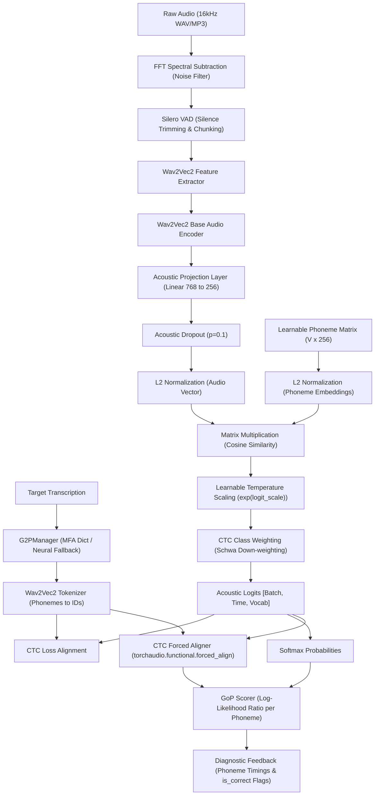

# Technical Deep Dive & Codebase Analysis Report

This report provides a comprehensive analysis of the **Clear Indian English Pronunciation Assessor** codebase located in `/home/mihir/Codes/CDAC_ASR`. It synthesizes the codebase files, the resource estimation data, and the proposed implementation plan to explain how the acoustic model, preprocessor, and scoring subsystems work, and how the planned retraining will occur.

---

## 1. System Architecture Diagram



---

## 2. Core Model Architecture: `Wav2Vec2PhonemeEmbedder`

The model defined in [phoneme_embedder.py](file:///home/mihir/Codes/CDAC_ASR/research/phoneme_embedder.py) diverges from standard CTC acoustic models (which project hidden states straight to character distributions via a linear layer). Instead, it implements a **Contrastive Audio-Phoneme Embedding Space** (Contrastive CTC).

### Mathematical Formulation & Processing Steps

1. **Audio Feature Extraction**:
   An input audio sequence $\mathbf{X}$ is passed through the `Wav2Vec2Model` encoder to extract local contextual representations:
   $$\mathbf{H} = \text{Wav2Vec2}(\mathbf{X}) \quad \text{where} \quad \mathbf{H} \in \mathbb{R}^{B \times T \times 768}$$

2. **Embedding Projection**:
   A linear projection map reduces the 768-dimensional audio state to a 256-dimensional metric space:
   $$\mathbf{Z}_{\text{audio}} = \text{LinearProj}(\mathbf{H}) \quad \text{where} \quad \mathbf{Z}_{\text{audio}} \in \mathbb{R}^{B \times T \times 256}$$
   A dropout rate of $0.1$ is applied to $\mathbf{Z}_{\text{audio}}$ to regularize the features.

3. **L2 Normalization**:
   Both the audio frame vectors and the learnable phoneme matrix $\mathbf{E} \in \mathbb{R}^{V \times 256}$ (where $V$ is the vocab size) are normalized to unit sphere vectors:
   $$\hat{\mathbf{z}}_{\text{audio}, b, t} = \frac{\mathbf{z}_{\text{audio}, b, t}}{\|\mathbf{z}_{\text{audio}, b, t}\|_2 + \epsilon}, \quad \hat{\mathbf{e}}_k = \frac{\mathbf{e}_k}{\|\mathbf{e}_k\|_2 + \epsilon}$$

4. **Cosine Similarity Logits**:
   Cosine similarity is computed via matrix multiplication and scaled using a learnable logit scale (inverse temperature parameter $\tau = 1 / e^{\theta}$):
   $$\mathbf{L}_{b, t, k} = e^{\theta} \cdot \langle \hat{\mathbf{z}}_{\text{audio}, b, t}, \hat{\mathbf{e}}_k \rangle$$
   *   $\theta$ (`self.logit_scale`) is a learnable scalar initialized to $\log(1/0.07) \approx 2.659$, preventing gradient saturation at the start of training.

5. **CTC Loss Optimization**:
   Logits are mapped into normalized distributions via log-softmax and matched against target phonemes using the connectionist temporal classification (CTC) criterion:
   $$\mathcal{L}_{\text{CTC}} = -\log P(\mathbf{Y} \mid \mathbf{X})$$

### Anti-Collapse Design
Contrastive models trained via CTC often suffer from *representation collapse*, where the projection parameters converge to a trivial solution (such as projecting all inputs to a single vector representing the blank/pad token or the highly frequent English schwa `/ə/`). The system implements:
*   **Acoustic Dropout (0.1)**: Forces the model to learn distributed acoustic patterns.
*   **Inverse-Frequency Class Weighting**: During log-probability calculation, the logits of highly frequent phonemes (specifically the schwa `/ə/` which makes up ~30% of Indian English accented speech) are penalized by applying additive log weights:
    $$\mathbf{L}_{b, t, k}' = \mathbf{L}_{b, t, k} + \log(w_k)$$
    Where $w_k = 0.3$ for `/ə/` and $1.0$ for all other classes. This penalizes the model for over-predicting the schwa.

---

## 3. Audio Preprocessing & G2P Subsystems

### Audio Preprocessing Pipeline (`AudioPreprocessor`)
Defined in [audio_utils.py](file:///home/mihir/Codes/CDAC_ASR/research/audio_utils.py), raw signals undergo two primary conditioning steps:
1.  **Spectral Subtraction (FFT Hiss Filter)**:
    *   Estimates background noise magnitude $\mu_N$ from the first 100ms of the recording (assumed silence).
    *   Transforms audio to the frequency domain via Fast Fourier Transform (FFT): $\mathbf{A}(f) = \text{FFT}(\mathbf{x}(t))$.
    *   Subtracts estimated noise magnitude scaled by a factor $\alpha$ (configured between $0.02$ and $0.04$):
        $$\hat{\mathbf{M}}(f) = \max(|\mathbf{A}(f)| - \alpha \cdot \mu_N, 0)$$
    *   Reconstructs the cleaned signal in the time domain: $\hat{\mathbf{x}}(t) = \text{Real}(\text{IFFT}(\hat{\mathbf{M}}(f) \cdot e^{i \angle \mathbf{A}(f)}))$.
2.  **Silero VAD (Voice Activity Detection)**:
    *   Leverages the state-of-the-art `silero_vad` neural model to detect boundaries of human speech.
    *   Crops out long periods of silence/static and concatenates the speech-active segments to form a dense sequence, increasing the signal-to-noise ratio and speeding up training steps.

### Grapheme-to-Phoneme (G2P) Pipeline (`G2PManager`)
Defined in [g2p_utils.py](file:///home/mihir/Codes/CDAC_ASR/research/g2p/g2p_utils.py), text transcriptions are converted to targets using a 3-tier fallback strategy:
1.  **MFA Gold Standard Dictionary**: Directly queries a local dictionary file [output_full.dict](file:///home/mihir/Codes/CDAC_ASR/research/g2p/output_full.dict) containing over 2,700 words aligned using the Montreal Forced Aligner (MFA).
2.  **Neural Fallback**: If the word is Out-Of-Vocabulary (OOV), it runs through the `g2p-en` neural model, which outputs ARPAbet phonemes (e.g. `["B", "IH0", "K", "AO1", "Z"]`).
3.  **ARPAbet-to-IPA Mapping**: Maps ARPAbet symbols to the target IPA format defined by the tokenizer vocab (`ARPABET_TO_IPA`), strips numerical stress markers, and cleans characters.
4.  **Identity Mapping**: As a final resort, yields the lowercase string.

---

## 4. Multi-Threaded Data Streaming Pipeline

To handle the **NPTEL2020** dataset (~130 GB) on local systems capped at a **50 GB disk ceiling**, the codebase introduces a zero-disk-footprint streaming architecture in [train_streaming.py](file:///home/mihir/Codes/CDAC_ASR/research/train_streaming.py).

### Double-Pass Streaming & Prefetching
Instead of downloading raw archives locally, the framework streams files from HuggingFace (`streaming=True`) using a multi-threaded queue-prefetch model:

```
[HuggingFace Stream] ──(Feeder Thread)──▶ [sample_q] ──▶ [Worker Threads 1..N] ──▶ [result_q] ──▶ [DataLoader]
                                                               │
                                                       (Local Preprocessors)
                                                       (FFT Filter & Silero VAD)
```

1.  **Feeder Thread**: Continuously pulls raw audio dictionary streams from HuggingFace and populates the `sample_q`.
2.  **Worker Threads ($N=12$)**: Parallel workers read from `sample_q`. Each worker instantiates a thread-safe copy of `AudioPreprocessor` to avoid CUDA locks on Silero VAD. They perform:
    *   Manual decoding of audio bytes using `soundfile`.
    *   FFT-based noise filtering & VAD silence trimming.
    *   G2P transcription mapping and index tokenization.
    *   Results are written to `result_q`.
3.  **Dataloader Queue Reading**: The PyTorch DataLoader pulls directly from `result_q`, achieving high training throughput (saturating H100/A6000 GPUs) without saving anything to the local disk.

---

## 5. Model Health Verification Subsystem

During training, `ModelHealthCheckCallback` tracks several safety metrics to early-stop training if the model begins to collapse:

| Diagnostic Metric | Detection Logic | Action |
| --- | --- | --- |
| **Embedding Collapse** | Computes average absolute off-diagonal cosine similarity: $\bar{s} = \frac{1}{V(V-1)} \sum_{i \neq j} |S_{i, j}|$. If $\bar{s} > 0.85$ for 2 checks. | Halts training & saves checkpoints to `early_stop_health_check` to prevent loss of previous progress. |
| **Blank Output Collapse** | Checks if validation predictions yield $0$ non-pad frames (only predicting `<pad>`) after the warmup period. | Halts training. |
| **Inference Divergence** | Computes Phoneme Error Rate (PER) on a static validation sample. If PER $\ge 99\%$ after 10,000 steps. | Halts training. |
| **NaN/Inf Loss** | Monitors running batch losses for numerical instability. | Saves state immediately and terminates. |

---

## 6. Retraining & GoP Diagnostics Implementation Plan

The proposed plan in `/home/mihir/.gemini/antigravity-ide/brain/e83a15f2-cf33-47e1-a873-ceb4c0f1ac2b/implementation_plan.md` builds upon the base codebase to solve regional Tamil/Telugu bias, improve noise handling, and implement Goodness of Pronunciation (GoP) diagnostics.

### Summary of Proposed Modules

```
                        ┌────────────────────────────────────────┐
                        │      1. Balanced Accent Mixture        │
                        │ (NPTEL, Common Voice, Svarah, MUCS...) │
                        └───────────────────┬────────────────────┘
                                            │
                                            ▼
                        ┌────────────────────────────────────────┐
                        │     2. Transcript Script Filtering     │
                        │   (Drops non-English Unicode characters)│
                        └───────────────────┬────────────────────┘
                                            │
                                            ▼
                        ┌────────────────────────────────────────┐
                        │       3. G2P Vocabulary Patching       │
                        │    (Eliminates <unk> via patch dict)   │
                        └───────────────────┬────────────────────┘
                                            │
                                            ▼
                        ┌────────────────────────────────────────┐
                        │      4. Model Retraining Callback      │
                        │   (Logs diversity & early-stops PER)   │
                        └───────────────────┬────────────────────┘
                                            │
                                            ▼
                        ┌────────────────────────────────────────┐
                        │       5. CTC Forced Aligner & GoP      │
                        │   (torchaudio forced_align + LLR scores)│
                        └───────────────────┬────────────────────┘
                                            │
                                            ▼
                        ┌────────────────────────────────────────┐
                        │      6. System Validation Utility      │
                        │ (verify_gop_system: test segment slice)│
                        └────────────────────────────────────────┘
```

#### A. Data Balance & Accent Regularization
*   **Balancing Mixture**: Concentrates the academic baseline (NPTEL, 50%) and introduces Western accents via Mozilla Common Voice India (20%), Northern accents via AI4Bharat Svarah (10%), Eastern accents via OpenSLR 104 MUCS (10%), and clinical medical terminology via Eka Care (10%).
*   **Script / Unicode Filtering**: Transcripts containing Devanagari, Bengali, Tamil, or regional scripts are excluded. Utterances composed purely of regional words are discarded at the dataloader stage.
*   **Vocab Patching**: Any incoming word mapping to `<unk>` in G2P is recorded in `patch_vocab.dict`. This patch dictionary is merged back into the G2PManager at runtime to guarantee $0$ unknown token issues.

#### B. Diagnostics & Forced Alignment Scoring Engine
To construct the GoP engine inside [ScoreCalcs.py](file:///home/mihir/Codes/CDAC_ASR/research/ScoreCalcs.py):
1.  **Forced Alignment**:
    Uses `torchaudio.functional.forced_align` on the log-softmax probabilities from the model logits and target phoneme token sequences to resolve exact boundary coordinates (start and end frames) for each expected phoneme.
2.  **Goodness of Pronunciation (GoP) Calculation**:
    Calculates the Log-Likelihood Ratio (LLR) over the aligned frame window:
    $$\text{GoP}(p) = \frac{1}{t_2 - t_1 + 1} \sum_{t=t_1}^{t_2} \log P(p \mid O_t)$$
    Where $P(p \mid O_t)$ is the softmax output probability of the target phoneme $p$ at frame $t$.
3.  **Thresholding**:
    Converts indices to milliseconds (20ms stride) and computes the probability $\exp(\text{GoP}(p))$. Phonemes falling below a $40\%$ probability threshold are flagged as incorrect (`is_correct = False`), color-coding them as red in diagnostic interfaces.

#### C. Corruption Verification Suite
A new script [verify_gop_system.py](file:///home/mihir/Codes/CDAC_ASR/research/verify_gop_system.py) will slice an audio sample at its phoneme boundaries, apply corruption (noise injection or silence) to specific segments (such as retroflex `/ʈ/`), and assert:
*   The GoP score for the corrupted phoneme falls below the $40\%$ threshold.
*   The GoP scores for surrounding uncorrupted segments remain high ($>40\%$), verifying diagnostic selectivity.

---

## 7. Verification & Retraining Plan Summary

The resource calculations and actual training history indicate that:
*   **Hardware Baseline**: The base matrix multiplication is highly efficient on modern Tensor Cores (such as the Cloud GPU A6000 or H100) using `bf16` precision.
*   **Real-World Training Duration**: In practice, training the 96M parameter model on the full NPTEL dataset (consisting of approximately 435,000 samples) for **85,000 steps** with an effective batch size of **64** takes **approximately 27 hours** (~1.14 seconds per step).
    *   This includes processing, queue operations, soundfile decoding overhead in CPU threads, and network latency when streaming dataset archives dynamically.
*   **Validation & Early Exit**: Validation metrics will track validation PER on the NPTEL subset, saving the final model checkpoint and exiting the training loop early when validation PER drops below **$15\%$**.
